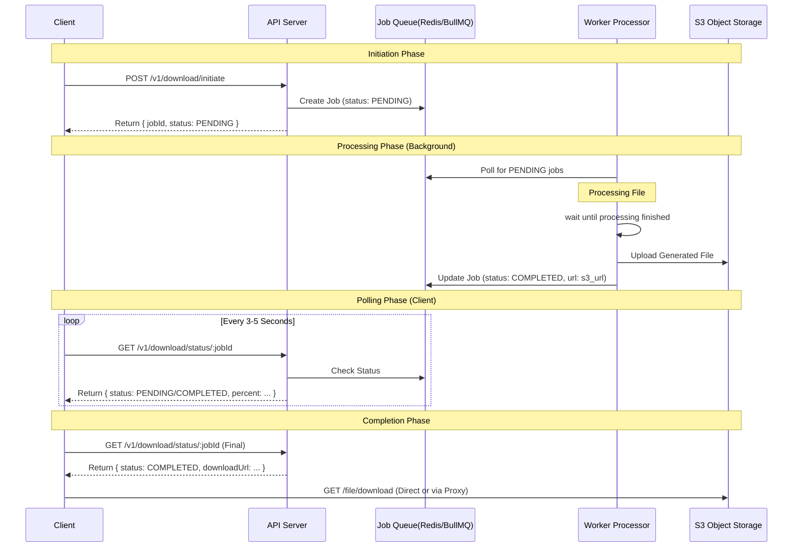

# Architecture Design: Long-Running Download Handling

## 1. Architecture Diagram

The proposed system utilizes the **Polling Pattern** to decouple the client request from the long-running processing task. This ensures that no HTTP connection is held open for longer than a few seconds, preventing timeouts from reverse proxies like Cloudflare or Nginx.



## 2. Technical Approach: Option A (Polling Pattern)

We have chosen the **Polling Pattern** for the following reasons:

1.  **Reliability**: HTTP Polling is stateless and extremely robust. It works over any network condition and doesn't require persistent connections like WebSockets, which can be dropped by aggressive firewalls or strict proxy settings.
2.  **Compatibility**: It solves the "Reverse Proxy Timeout" issue (Challenge 2's core problem) by keeping every single HTTP request short (well under the 100s Cloudflare limit).
3.  **Simplicity**: It doesn't require a separate WebSocket server or complex state management on the backend. The existing HTTP API infrastructure can be reused.
4.  **Scalability**: Stateless requests effectively leverage standard load balancing strategies.

## 3. Implementation Details

### API Contract Changes

We need to introduce a job-based workflow.

#### Existing Endpoints (Deprecated/Internal Use Only)
- `POST /v1/download/start`: Direct blocking download (prone to timeouts).

#### New Endpoints
**1. Initiate Download**
- **Endpoint**: `POST /v1/jobs/download`
- **Body**: `{ "file_id": 70000 }`
- **Response**: `202 Accepted`
```json
{
  "jobId": "uuid-1234-5678",
  "status": "pending",
  "checkUrl": "/v1/jobs/uuid-1234-5678"
}
```

**2. Check Status**
- **Endpoint**: `GET /v1/jobs/:jobId`
- **Response**: `200 OK`
```json
{
  "jobId": "uuid-1234-5678",
  "status": "processing", // pending, processing, completed, failed
  "progress": 45,         // estimated percentage
  "result": null
}
```
*When complete:*
```json
{
  "jobId": "uuid-1234-5678",
  "status": "completed",
  "result": {
      "downloadUrl": "https://api.example.com/v1/downloads/signed/uuid-1234-5678",
      "expiresAt": "2025-12-12T12:00:00Z"
  }
}
```

### Database Schema (Job Store)

A new `jobs` table/collection is required to track state.

```typescript
interface Job {
  id: string;              // UUID
  type: 'download';
  status: 'pending' | 'processing' | 'completed' | 'failed';
  payload: Record<string, any>; // { file_id: 70000 }
  result?: {
    s3Key: string;
    size: number;
  };
  createdAt: Date;
  updatedAt: Date;
}
```

### Background Processing Strategy
Instead of processing the file in the request handler:
1.  **Queue**: Use a lightweight queue.
    - **In-Memory** (Development): Simple array/Map. Fast but loses data on restart.
    - **Redis + BullMQ** (Production): Robust, persistent, supports retries and priorities.
2.  **Worker**: A separate worker process (or concurrent worker threads) picks up jobs.
3.  **Timeout Handling**: If a job hangs for > 5 minutes, the worker should mark it as `failed` to allow retry.

### Handling Edge Cases & Scalability

#### 1. Abandoned Downloads (Browser Close)
Since the processing happens in the background, a user closing the tab does **not** stop the server processing. This is a feature, not a bug, but it can lead to wasted resources.
- **Mitigation**: We Implement a **TTL (Time-To-Live)** policy.
    - Generated files on S3 are tagged with an expiry (e.g., 24 hours) or a Lifecycle Policy deletes them after 1 day.
    - Job records in the database are hard-deleted or archived after 7 days.
    - If a user never polls for > 10 minutes, we could technically cancel the job if our queue system supports cancellation, but for < 2 minute jobs, it's often simpler to let it finish and expire the artifact.

#### 2. Concurrent Downloads
The **Job ID** pattern inherently solves concurrency.
- A user can initiate 5 downloads simultaneously.
- Each call to `/v1/jobs/download` returns a unique `jobId`.
- The frontend tracks these IDs individually (e.g., in a list of "Active Downloads").
- **Rate-Limiting**: To prevent abuse, we apply a rate limit on the *Initiate* endpoint (e.g., 10 jobs/minute per IP), but pulling status is cheap.

### Cost & Trade-off Analysis

| Feature | In-Memory (Node.js) | Redis (BullMQ) | AWS SQS / Cloud Tasks |
| :--- | :--- | :--- | :--- |
| **Cost** | Free (RAM) | Low ($5-20/mo) | Pay-per-use (Cheap) |
| **Complexity** | Very Low | Medium (Setup req.) | Medium |
| **Persistence** | No (Lost on restart) | Yes | Yes (High durability) |
| **Scalability** | Single Instance | High (Multi-worker) | Extremely High |
| **Recommendation** | **Development** | **Production** | Large Scale |

### Why S3 Presigned URLs? (Direct Download)
We return a signed URL (`https://s3.example.com/...`) instead of streaming through our API.
1.  **Bandwidth Offloading**: High-volume file transfers go Client <-> S3 directly. Our API server only handles tiny JSON payloads.
2.  **Security**: The URL is valid for a limited time (e.g., 15 minutes).
3.  **Performance**: S3 is optimized for delivering static assets; Node.js event loop remains free for API logic.

## 4. Proxy Configuration

With the Polling Pattern, we no longer need extended timeouts for client-facing connections. However, we should ensure the upstream configuration allows for standard requests.

### Nginx Configuration

```nginx
server {
    listen 80;
    server_name api.example.com;

    location / {
        proxy_pass http://backend_service:3000;
        
        # Standard timeouts are fine now (e.g., 60s)
        # We don't need 300s+ timeouts anymore
        proxy_read_timeout 60s;
        proxy_connect_timeout 60s;
        proxy_send_timeout 60s;

        # Standard headers
        proxy_set_header Host $host;
        proxy_set_header X-Real-IP $remote_addr;
    }
}
```

### Cloudflare
- **Timeouts**: Default (100s) is now perfectly safe because no request will take longer than a few hundred milliseconds.
- **Caching**: We should ensure `GET /v1/jobs/:jobId` is **not cached** so the client always gets the latest status.
    - Header: `Cache-Control: no-cache, no-store, must-revalidate`

## 5. Frontend Integration (React/Next.js)

The frontend needs a state machine to handle the polling logic.

### Polling Logic Hook (`useDownloadJob`)

1.  **Initiate**: User clicks "Download". Frontend calls `POST /v1/jobs/download`.
2.  **Wait**: Receive `jobId`. Enter "Polling" state.
3.  **Poll**: `setInterval` every 2s to call `GET /v1/jobs/:jobId`.
4.  **Updates**: Update progress bar based on `progress` field.
5.  **Completion**: When `status === 'completed'`, clear interval, show "Download Ready" button or auto-trigger `window.location.href = downloadUrl`.
6.  **Error Handling**:
    - If `status === 'failed'`, show error message.
    - If 5+ consecutive poll failures (network error), pause and retry with exponential backoff.
    - **User Exit**: If user closes tab, the job completes on server anyway (resource waste handled by server TTL), but client stops polling.

### Example React Component Logic

```tsx
const handleDownload = async () => {
  setIsLoading(true);
  try {
    // 1. Start Job
    const { jobId } = await api.post('/v1/jobs/download', { file_id: 70000 });
    
    // 2. Poll
    const poll = setInterval(async () => {
      const statusRes = await api.get(`/v1/jobs/${jobId}`);
      
      if (statusRes.status === 'completed') {
        clearInterval(poll);
        setIsLoading(false);
        // Trigger actual download
        window.location.href = statusRes.result.downloadUrl;
      } else if (statusRes.status === 'failed') {
        clearInterval(poll);
        setError('Download failed on server');
      }
    }, 2000);
    
  } catch (err) {
    setError('Failed to start download');
  }
};
```
