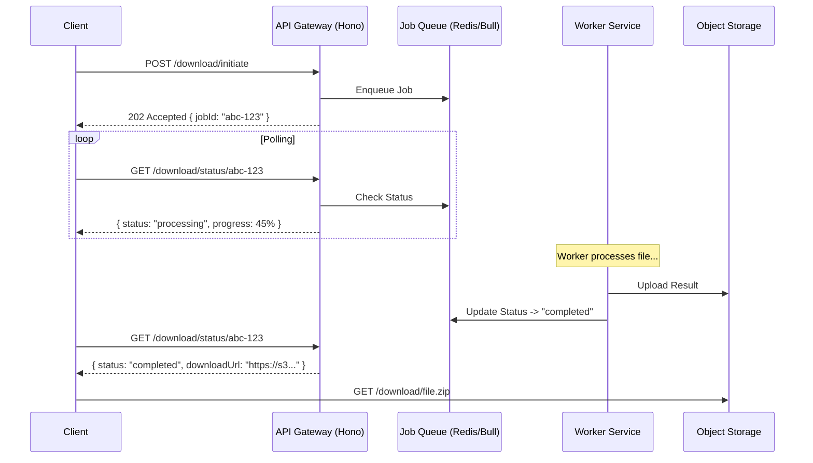

# Long-Running Download Architecture

## Problem Statement

The current system faces timeouts (e.g. Cloudflare 100s limit) and poor UX when processing large downloads that take 10-120 seconds.

## Selected Approach: Polling Pattern

We will implement an **Asynchronous Polling Pattern**. This is preferred for its robustness and simplicity in handling timeouts across various proxy layers.

### Justification

1.  **Timeout Avoidance**: Client requests never hang. The initial request returns immediately.
2.  **Resilience**: If the client disconnects, the job continues processing. The client can resume polling later.
3.  **Simplicity**: Easier to implement and debug than WebSockets (no persistent connections to manage/scale).
4.  **Compatibility**: Works perfectly with standard HTTP proxies and load balancers.

## 1. Architecture Diagram



## 2. Implementation Details

### API Contract Changes

#### New Endpoint: `GET /v1/download/status/:jobId`

Returns the status of a specific download job.

**Response:**

```json
{
  "jobId": "abc-123",
  "status": "pending" | "processing" | "completed" | "failed",
  "progress": 0-100,
  "downloadUrl": "http://...", // Only present if completed
  "error": "..." // Only present if failed
}
```

#### Modified Endpoint: `POST /v1/download/initiate`

Currently returns `jobId`. This remains the same, but implementation shifts from simulated delay to actual background enqueueing (mocked or real).

### Database/Cache Schema (Redis)

We use Redis for both the job queue and status storage.

**Key:** `job:{jobId}`
**Value:**

```json
{
  "status": "processing",
  "fileIds": [1, 2, 3],
  "createdAt": "2024-10-01T12:00:00Z",
  "resultKey": "s3-key.zip"
}
```

### Background Job Processing

- **Library**: `bullmq` (Redis-based queue for Node.js).
- **Worker**: A separate process or thread that performs the heavy file aggregation/zipping tasks.
- **Queue**: `download-queue`.

### Error Handling & Retries

- Worker retries jobs up to 3 times on transient failures.
- Dead Letter Queue (DLQ) for permanently failed jobs.
- Exponential backoff for retries.

### Timeouts

- **API Request**: 30s (Client -> API). API responds much faster than this.
- **Worker Job**: 5 minutes (Worker execution limit).

## 3. Proxy Configuration

### Nginx

```nginx
location /v1/download/ {
    proxy_read_timeout 30s; # Short timeout is fine now
    proxy_connect_timeout 5s;
}
```

### Cloudflare

- No special configuration needed as long-running requests are eliminated.

## 4. Frontend Integration (React)

### Workflow

1.  **Initiate**: User clicks "Download". App calls `POST /initiate`.
2.  **Poll**: App receives `jobId`. Starts a `setInterval` (e.g., every 2s) to call `GET /status/:jobId`.
3.  **Progress**: Update a progress bar in the UI based on `progress` field.
4.  **Complete**: When `status === 'completed'`, stop polling and redirect user to `downloadUrl` or show a "Download Ready" button.
5.  **Error**: Handle non-200 responses or `status === 'failed'`.

### User Experience

- Show a "Preparing your metrics..." toast or modal.
- Allow user to minimize the modal and continue working while download processes (background polling).
- Notify user when ready if they navigated away (via toast).
