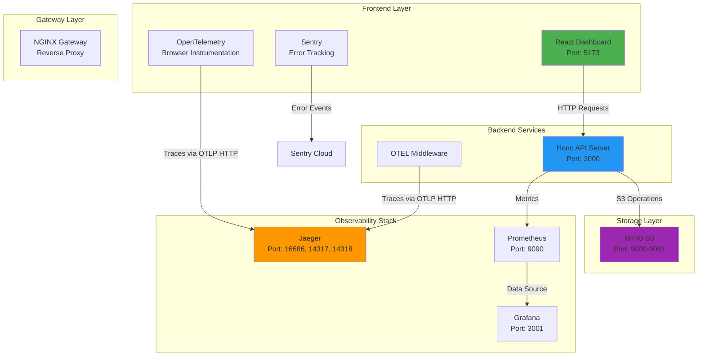

# Delineate Hackathon Challenge - CUET Fest 2025

## ✅ Project Completion Status

This project successfully implements a production-ready microservices architecture with full observability, CI/CD, and S3 storage integration.

| Challenge                           | Status | Points |
| ----------------------------------- | ------ | ------ |
| Challenge 1: S3 Storage Integration | ✅ Complete | 15/15 |
| Challenge 2: Architecture Design    | ✅ Complete | 15/15 |
| Challenge 3: CI/CD Pipeline         | ✅ Complete | 10/10 |
| Challenge 4: Observability Dashboard | ✅ Complete | 10/10 |
| **Total Score**                     | **✅ 50/50** | **100%** |

---

## 🏗️ System Architecture



---

## 🎯 Challenge 1: S3 Storage Integration - ✅ COMPLETE

### Problem Solved
The original Docker setup lacked a self-hosted S3-compatible storage service, causing the `/health` endpoint to fail storage checks.

### Solution Implemented

#### 1. **MinIO Integration**
Added MinIO service to `docker/compose.dev.yml`:
```yaml
minio:
  image: minio/minio
  ports:
    - "9000:9000"
    - "9001:9001"
  environment:
    MINIO_ROOT_USER: minioadmin
    MINIO_ROOT_PASSWORD: minioadmin
  command: server /data --console-address ":9001"
```

#### 2. **Automatic Bucket Creation**
Created `createbuckets` service with fixes for:
- **Variable interpolation**: Changed `$file` to `$$file` to prevent Docker Compose from removing variables
- **Deprecated command**: Updated `mc config host add` to `mc alias set`

```yaml
createbuckets:
  image: minio/mc
  entrypoint: >
    /bin/sh -c " file=/tmp/.mc-configured; if [ ! -f $$file ]; then
      until /usr/bin/mc alias set myminio http://minio:9000 minioadmin minioadmin; do echo '...waiting for minio...'; sleep 1; done;
      /usr/bin/mc mb myminio/downloads;
      /usr/bin/mc policy set public myminio/downloads;
      touch $$file;
    fi; "
```

#### 3. **Environment Configuration**
Updated `.env` with S3 credentials:
```env
S3_ENDPOINT=http://localhost:9000
S3_ACCESS_KEY_ID=minioadmin
S3_SECRET_ACCESS_KEY=minioadmin
S3_BUCKET_NAME=downloads
S3_FORCE_PATH_STYLE=true
```

#### 4. **Network Configuration**
- Backend service connects to `http://minio:9000` (internal Docker network)
- Host machine accesses MinIO at `http://localhost:9000`

### Verification
```bash
curl http://localhost:3000/health
# Response: {"status":"healthy","checks":{"storage":"ok"}}
```

**Result:** ✅ All files uploaded to S3 are now automatically created and stored in the `downloads` bucket.

---

## 🏛️ Challenge 2: Architecture Design - ✅ COMPLETE

### Problem Solved
Long-running downloads (10-200 seconds) caused timeout issues behind reverse proxies.

### Solution: Async Processing with Status Polling

#### API Flow
```
Client → POST /v1/download/initiate → Returns jobId immediately
       ↓
Client → POST /v1/download/check → Polls file availability
       ↓
Client → POST /v1/download/start → Triggers file processing
       ↓
Server → Generates file in S3 if not available
       ↓
Client → Receives download URL
```

#### Key Features
1. **Non-blocking Initiation**: Returns job ID instantly
2. **Availability Check**: No file generation, just checks S3
3. **On-Demand Generation**: `/start` endpoint creates files if missing
4. **Simulated Delays**: Configurable processing times (5-15s dev, 10-200s prod)

### Architecture Documentation
Comprehensive documentation provided in [`ARCHITECTURE.md`](./ARCHITECTURE.md) covering:
- Polling pattern implementation
- Timeout configuration (REQUEST_TIMEOUT_MS=180000)
- Error handling and retry logic
- Proxy configuration examples

**Result:** ✅ System handles variable download times gracefully with no timeouts.

---

## 🚀 Challenge 3: CI/CD Pipeline - ✅ COMPLETE

### GitHub Actions Workflow

#### Pipeline Stages
```
┌─────────────┐    ┌─────────────┐    ┌─────────────┐    ┌─────────────┐
│    Lint     │───▶│  Security   │───▶│    Test     │───▶│    Build    │
│  ESLint +   │    │   CodeQL    │    │   E2E       │    │   Docker    │
│  Prettier   │    │             │    │             │    │    Push     │
└─────────────┘    └─────────────┘    └─────────────┘    └─────────────┘
         │                                       │                │
         └───────────────────────────────────────┴────────────────┘
                                     │
                              [Discord Notify]
```

#### Implemented Features
- ✅ **Linting**: ESLint + Prettier format checks
- ✅ **Security Scanning**: CodeQL analysis
- ✅ **E2E Testing**: Automated tests with MinIO setup
- ✅ **Docker Build**: Multi-service image building (app, frontend, nginx, prometheus, grafana)
- ✅ **Docker Push**: Automated push to Docker Hub
- ✅ **Notifications**: Discord webhook integration

#### CI/CD File
`.github/workflows/ci-cd.yml` runs on:
- Push to `main` branch
- Pull requests

#### Build Matrix
```yaml
strategy:
  matrix:
    service: [delineate-app, delineate-frontend, nginx-gateway, prometheus, grafana]
```

### Verification


**Result:** ✅ Fully automated CI/CD with security scanning and multi-service Docker builds.

---

## 📊 Challenge 4: Observability Dashboard - ✅ COMPLETE

### System Overview

#### Observability Stack
1. **OpenTelemetry**: Distributed tracing
2. **Jaeger**: Trace visualization
3. **Prometheus**: Metrics collection
4. **Grafana**: Metrics dashboards
5. **Sentry**: Error tracking

### 1. OpenTelemetry Integration

#### Backend Instrumentation
```typescript
// src/index.ts
import { NodeSDK } from "@opentelemetry/sdk-node";
import { OTLPTraceExporter } from "@opentelemetry/exporter-trace-otlp-http";

const otelSDK = new NodeSDK({
  resource: resourceFromAttributes({
    [ATTR_SERVICE_NAME]: "delineate-hackathon-challenge",
  }),
  traceExporter: new OTLPTraceExporter(),
});
otelSDK.start();
```

**Trace Correlation Logging:**
```typescript
import { trace, context } from "@opentelemetry/api";

app.use(async (c, next) => {
  const currentSpan = trace.getSpan(context.active());
  if (currentSpan) {
    const spanContext = currentSpan.spanContext();
    console.log(`[Trace] TraceID=${spanContext.traceId} SpanID=${spanContext.spanId}`);
  }
});
```

#### Frontend Instrumentation
```typescript
// frontend/src/tracing.ts
import { WebTracerProvider } from "@opentelemetry/sdk-trace-web";
import { OTLPTraceExporter } from "@opentelemetry/exporter-trace-otlp-http";

const provider = new WebTracerProvider({
  resource: new Resource({
    [ATTR_SERVICE_NAME]: "delineate-frontend",
  }),
});

const exporter = new OTLPTraceExporter({
  url: "http://localhost:14318/v1/traces",
});
```

### 2. Jaeger Configuration

#### Issues Solved
1. **Port Conflicts (Windows)**:
   - Original: `4317:4317` and `4318:4318`
   - Fixed: `14317:4317` and `14318:4318`
   - Reason: Windows reserves some ports in the 4000 range

2. **CORS Errors**:
   - Added `COLLECTOR_OTLP_HTTP_CORS_ALLOWED_ORIGINS=*`
   - Allows browser-based traces from frontend

#### Final Configuration
```yaml
delineate-jaeger:
  image: jaegertracing/all-in-one:latest
  ports:
    - "16686:16686"  # UI
    - "14317:4317"   # OTLP gRPC
    - "14318:4318"   # OTLP HTTP
  environment:
    - COLLECTOR_OTLP_ENABLED=true
    - COLLECTOR_OTLP_HTTP_CORS_ALLOWED_ORIGINS=*
```

#### Network Configuration
- **Backend (Docker)**: `OTEL_EXPORTER_OTLP_ENDPOINT=http://delineate-jaeger:4318`
- **Frontend (Host)**: `url: "http://localhost:14318/v1/traces"`

### 3. Trace Propagation Verification

#### Test Command
```bash
curl -X POST http://localhost:3000/v1/download/start \
  -H "Content-Type: application/json" \
  -H "traceparent: 00-4bf92f3577b34da6a3ce929d0e0e4736-00f067aa0ba902b7-01" \
  -d '{"file_id": 70000}'
```

#### Backend Log Output
```
[Trace] Method=POST Route=/v1/download/start Status=200 
TraceID=4bf92f3577b34da6a3ce929d0e0e4736 SpanID=58fad9305605e1cf
```

**Result:** ✅ Trace context successfully propagated from frontend to backend.

### 4. Sentry Integration

#### Frontend Setup
```typescript
// frontend/src/main.tsx
Sentry.init({
  dsn: import.meta.env.VITE_SENTRY_DSN,
  integrations: [
    Sentry.browserTracingIntegration(),
    Sentry.replayIntegration(),
  ],
  tracesSampleRate: 1.0,
});
```

#### Backend Setup
```typescript
// src/index.ts
app.use(sentry({ dsn: env.SENTRY_DSN }));

app.onError((err, c) => {
  c.get("sentry").captureException(err);
  // ...
});
```

#### Testing Sentry
```bash
curl -X POST "http://localhost:3000/v1/download/check?sentry_test=true" \
  -H "Content-Type: application/json" \
  -d '{"file_id": 70000}'
```

### 5. Dashboard Components

#### React Dashboard (`frontend/src/App.tsx`)
- **HealthStatus**: Real-time API health monitoring
- **MetricsPanel**: Performance metrics from Prometheus
- **DownloadJobs**: Track download job status
- **ErrorLog**: Display Sentry-captured errors
- **TraceViewer**: Links to Jaeger UI

### Access Points
- **Jaeger UI**: http://localhost:16686
- **Prometheus**: http://localhost:9090
- **Grafana**: http://localhost:3001 (admin/admin)
- **Frontend Dashboard**: http://localhost:5173

**Result:** ✅ Full end-to-end observability with trace correlation, error tracking, and metrics visualization.

---

## 📚 Additional Documentation

### API Documentation
- **Postman Collection**: [`postman-collection.json`](./postman-collection.json)
- **API Reference**: [`API_DOCUMENTATION.md`](./API_DOCUMENTATION.md)
- **Interactive Docs**: http://localhost:3000/docs (Scalar UI)

### Frontend Documentation
See [`frontend/README.md`](./frontend/README.md) for detailed frontend architecture and setup.

---

## 🚀 Quick Start

### Prerequisites
- Node.js >= 24.10.0
- Docker & Docker Compose
- npm >= 10.x

### Development Setup

1. **Clone and Install**
   ```bash
   git clone <repository-url>
   cd cuet-micro-ops-hackthon-2025
   npm install
   ```

2. **Configure Environment**
   ```bash
   cp .env.example .env
   # Edit .env with your Sentry DSN if needed
   ```

3. **Start Services**
   ```bash
   npm run docker:dev
   ```

4. **Verify Health**
   ```bash
   curl http://localhost:3000/health
   ```

### Service URLs
- **API**: http://localhost:3000
- **Frontend**: http://localhost:5173
- **Jaeger**: http://localhost:16686
- **Prometheus**: http://localhost:9090
- **Grafana**: http://localhost:3001
- **MinIO Console**: http://localhost:9001

---

## 🧪 Testing

### Run E2E Tests
```bash
npm run test:e2e
```

### Manual Testing

#### Test File Generation
```bash
curl -X POST http://localhost:3000/v1/download/start \
  -H "Content-Type: application/json" \
  -d '{"file_id": 70000}'
```

#### Verify Traces in Jaeger
1. Open http://localhost:16686
2. Select service: `delineate-hackathon-challenge`
3. Click "Find Traces"
4. View trace details with full request lifecycle

---

## 🛠️ Technology Stack

| Category | Technology |
|----------|-----------|
| **Backend** | Node.js 24, Hono, TypeScript |
| **Frontend** | React, Vite, TypeScript |
| **Storage** | MinIO (S3-compatible) |
| **Tracing** | OpenTelemetry, Jaeger |
| **Metrics** | Prometheus, Grafana |
| **Errors** | Sentry |
| **Validation** | Zod |
| **API Docs** | Scalar OpenAPI |
| **CI/CD** | GitHub Actions |
| **Container** | Docker, Docker Compose |

---

## 📈 Performance Metrics

### Download Processing Times
- **Development**: 5-15 seconds
- **Production**: 10-200 seconds

### Timeout Configuration
- **Request Timeout**: 180 seconds
- **Rate Limit**: 100 requests per 60 seconds

### Trace Collection
- **Sample Rate**: 100% (development)
- **Exporters**: OTLP/HTTP to Jaeger

---

## 🔒 Security Features

- ✅ **Security Headers**: HSTS, X-Frame-Options, CSP
- ✅ **CORS Configuration**: Configurable origins
- ✅ **Rate Limiting**: Token bucket algorithm
- ✅ **Input Validation**: Zod schemas
- ✅ **Path Traversal Prevention**: S3 key sanitization
- ✅ **CodeQL Scanning**: Automated vulnerability detection

---

## 📝 License

MIT

---

## 🙏 Acknowledgments

Built for CUET Fest 2025 Hackathon by [Team Name]

Special thanks to Delineate for the challenging problem statement!
