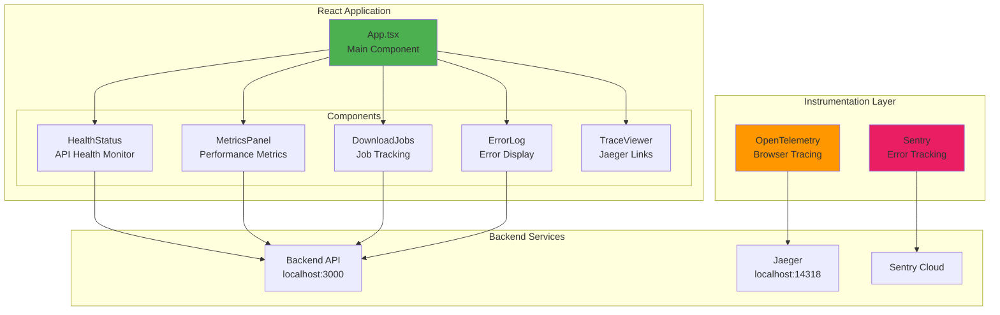

# Frontend - Observability Dashboard

A React-based observability dashboard for monitoring the Download Microservice, featuring real-time health checks, metrics visualization, error tracking, and distributed tracing.

---

## 🏗️ Architecture



---

## 🚀 Quick Start

### Prerequisites

- Node.js >= 18
- Backend services running (see main README)

### Installation

```bash
cd frontend
npm install
```

### Development

```bash
npm run dev
```

Access the dashboard at: http://localhost:5173

### Build for Production

```bash
npm run build
npm run preview
```

---

## 📁 Project Structure

```
frontend/
├── src/
│   ├── main.tsx              # Application entry point
│   ├── App.tsx               # Main app component
│   ├── tracing.ts            # OpenTelemetry configuration
│   ├── index.css             # Global styles
│   └── components/
│       ├── HealthStatus.tsx  # API health monitoring
│       ├── MetricsPanel.tsx  # Metrics visualization
│       ├── DownloadJobs.tsx  # Download job tracking
│       ├── ErrorLog.tsx      # Error display
│       └── TraceViewer.tsx   # Jaeger UI links
├── Dockerfile                # Production container
├── package.json
└── vite.config.ts
```

---

## 🧩 Component Details

### 1. App.tsx

Main application component that orchestrates the dashboard layout.

**Features:**

- Polls `/health` endpoint every 5 seconds
- Renders dashboard grid layout
- Manages loading states

**Key Code:**

```typescript
useEffect(() => {
  fetchHealth();
  const interval = setInterval(fetchHealth, 5000);
  return () => clearInterval(interval);
}, []);
```

### 2. HealthStatus Component

Displays real-time API health status.

**Props:**

- `data`: Health check response
- `apiUrl`: Backend API URL

**Displays:**

- Service status (healthy/unhealthy)
- Storage status (ok/error)
- Visual indicators with color coding

### 3. MetricsPanel Component

Shows performance metrics from Prometheus.

**Features:**

- HTTP request duration metrics
- Request counts by endpoint
- Success/error rates

**Props:**

- `apiUrl`: Backend API URL

### 4. DownloadJobs Component

Tracks download job statuses.

**Features:**

- Initiate new download jobs
- Check file availability
- Start download processing
- Display job results

**API Integration:**

```typescript
// Initiate download
POST /v1/download/initiate
{ "file_ids": [10000, 10001] }

// Check availability
POST /v1/download/check
{ "file_id": 10000 }

// Start download
POST /v1/download/start
{ "file_id": 10000 }
```

### 5. ErrorLog Component

Displays errors captured by Sentry.

**Features:**

- Trigger test errors
- Display recent error events
- Link to Sentry dashboard

**Test Error Button:**

```typescript
const triggerError = async () => {
  await fetch(`${apiUrl}/v1/download/check?sentry_test=true`, {
    method: "POST",
    body: JSON.stringify({ file_id: 70000 }),
  });
};
```

### 6. TraceViewer Component

Links to Jaeger UI for distributed tracing.

**Features:**

- Direct link to Jaeger UI
- Service name display
- Trace search guidance

---

## 🔭 Observability Integration

### OpenTelemetry Setup

#### Configuration (`src/tracing.ts`)

```typescript
import { WebTracerProvider } from "@opentelemetry/sdk-trace-web";
import { OTLPTraceExporter } from "@opentelemetry/exporter-trace-otlp-http";

export function initInstrumentation() {
  const provider = new WebTracerProvider({
    resource: new Resource({
      [ATTR_SERVICE_NAME]: "delineate-frontend",
    }),
  });

  const exporter = new OTLPTraceExporter({
    url: "http://localhost:14318/v1/traces",
  });

  provider.addSpanProcessor(new SimpleSpanProcessor(exporter));
  provider.register({ contextManager: new ZoneContextManager() });

  registerInstrumentations({
    instrumentations: [
      new DocumentLoadInstrumentation(),
      new UserInteractionInstrumentation(),
      new XMLHttpRequestInstrumentation(),
      new FetchInstrumentation(),
    ],
  });
}
```

#### Initialization (`src/main.tsx`)

```typescript
import { initInstrumentation } from "./tracing";

// Initialize OpenTelemetry
initInstrumentation();
```

#### Automatic Instrumentation

The following are automatically traced:

- **Document Load**: Page load times
- **User Interactions**: Click events, form submissions
- **XHR Requests**: AJAX calls
- **Fetch Requests**: Modern HTTP requests

#### Trace Propagation

Frontend automatically propagates trace context to backend via `traceparent` header:

```
traceparent: 00-{trace-id}-{span-id}-{flags}
```

### Sentry Integration

#### Configuration (`src/main.tsx`)

```typescript
import * as Sentry from "@sentry/react";

Sentry.init({
  dsn: import.meta.env.VITE_SENTRY_DSN,
  integrations: [
    Sentry.browserTracingIntegration(),
    Sentry.replayIntegration(),
  ],
  tracesSampleRate: 1.0,
  replaysSessionSampleRate: 0.1,
  replaysOnErrorSampleRate: 1.0,
});
```

#### Error Boundary

```typescript
<Sentry.ErrorBoundary fallback={<div>An error has occurred</div>}>
  <App />
</Sentry.ErrorBoundary>
```

#### Features

- **Automatic Error Capture**: Catches unhandled exceptions
- **Performance Monitoring**: Tracks page load and navigation
- **Session Replay**: Records user sessions on error
- **Breadcrumbs**: Tracks user actions leading to errors

---

## 🎨 Styling

### CSS Architecture

- **Global Styles**: `src/index.css`
- **Component-Scoped**: Inline styles with CSS-in-JS patterns
- **Responsive Design**: Mobile-first approach

### Design System

- **Colors**: Material Design inspired palette
- **Typography**: System fonts with fallbacks
- **Spacing**: 8px grid system
- **Animations**: Smooth transitions for state changes

---

## 🔧 Configuration

### Environment Variables

Create a `.env` file in the frontend directory:

```env
# API Configuration
VITE_API_URL=http://localhost:3000

# Sentry (Optional)
VITE_SENTRY_DSN=https://your-sentry-dsn@sentry.io/project-id

# OpenTelemetry
# OTLP endpoint is hardcoded in tracing.ts
# Default: http://localhost:14318/v1/traces
```

### Vite Configuration (`vite.config.ts`)

```typescript
export default defineConfig({
  plugins: [react()],
  server: {
    host: "0.0.0.0",
    port: 5173,
  },
});
```

---

## 🐳 Docker Deployment

### Production Build

```bash
docker build -t delineate-frontend .
docker run -p 5173:5173 delineate-frontend
```

### Docker Compose

Already included in `docker/compose.dev.yml`:

```yaml
delineate-frontend:
  build:
    context: ../frontend
    dockerfile: Dockerfile
  ports:
    - "5173:5173"
  volumes:
    - ../frontend/src:/app/src
```

---

## 📊 Monitoring the Frontend

### View Traces in Jaeger

1. Open http://localhost:16686
2. Select service: `delineate-frontend`
3. Click "Find Traces"
4. View:
   - Page load times
   - API request traces
   - User interactions

### View Errors in Sentry

1. Configure `VITE_SENTRY_DSN`
2. Trigger errors via "Trigger Backend Error" button
3. View in Sentry dashboard:
   - Error stack traces
   - Session replays
   - User context

### View Metrics in Grafana

1. Open http://localhost:3001 (admin/admin)
2. Import Prometheus data source
3. Create dashboards for:
   - Frontend request success rates
   - API response times
   - Error rates

---

## 🧪 Testing

### Manual Testing

#### Test Health Check

1. Open http://localhost:5173
2. Verify health status shows "Healthy"
3. Stop backend: `docker stop delineate-delineate-app-1`
4. Verify health status shows "Unhealthy"

#### Test Download Flow

1. Click "Initiate Download"
2. Enter file IDs: `10000, 10001`
3. Click "Check Availability"
4. Enter file ID: `10000`
5. Click "Start Download"
6. View processing result

#### Test Error Tracking

1. Click "Trigger Backend Error"
2. Check browser console for error
3. Verify error appears in Sentry dashboard

#### Test Tracing

1. Perform any action (e.g., health check)
2. Click "Open Jaeger UI"
3. Search for `delineate-frontend` service
4. Verify traces appear with:
   - Frontend span
   - Backend span (if propagated)

---

## 🛠️ Development Tools

### Available Scripts

```bash
# Start development server
npm run dev

# Build for production
npm run build

# Preview production build
npm run preview

# Lint code
npm run lint

# Format code
npm run format
```

### Browser DevTools

#### OpenTelemetry Console Logs

Check browser console for OTEL debug messages:

```
[OpenTelemetry] Span exported: { traceId: "...", spanId: "..." }
```

#### Network Tab

Monitor outgoing requests:

- API calls to backend
- OTLP trace exports to Jaeger
- Sentry error reports

---

## 🔍 Troubleshooting

### Issue: Traces not appearing in Jaeger

**Solution:**

1. Verify Jaeger is running: `docker ps | grep jaeger`
2. Check CORS headers:
   ```bash
   curl -v -X OPTIONS http://localhost:14318/v1/traces \
     -H "Origin: http://localhost:5173" \
     -H "Access-Control-Request-Method: POST"
   ```
3. Ensure `COLLECTOR_OTLP_HTTP_CORS_ALLOWED_ORIGINS=*` in Docker Compose
4. Check browser console for CORS errors

### Issue: Sentry errors not captured

**Solution:**

1. Verify `VITE_SENTRY_DSN` is set
2. Check Sentry debug mode:
   ```typescript
   Sentry.init({ debug: true, ... });
   ```
3. Verify network request to Sentry in browser DevTools

### Issue: API requests failing

**Solution:**

1. Verify backend is running: `curl http://localhost:3000/health`
2. Check `VITE_API_URL` environment variable
3. Verify CORS is enabled on backend
4. Check browser console for CORS errors

---

## 📚 Learn More

### Technologies Used

- **React 18**: UI framework
- **TypeScript**: Type safety
- **Vite**: Build tool
- **OpenTelemetry**: Distributed tracing
- **Sentry**: Error tracking
- **CSS**: Styling

### Resources

- [OpenTelemetry JavaScript Docs](https://opentelemetry.io/docs/instrumentation/js/)
- [Sentry React SDK](https://docs.sentry.io/platforms/javascript/guides/react/)
- [Vite Documentation](https://vitejs.dev/)
- [React Documentation](https://react.dev/)

---

## 🤝 Contributing

### Code Style

- Use TypeScript for type safety
- Follow ESLint rules
- Format with Prettier
- Add comments for complex logic

### Component Guidelines

- Keep components small and focused
- Use functional components with hooks
- Implement proper error boundaries
- Add loading states for async operations

---

## 📝 License

MIT

---

## 🎯 Future Enhancements

- [ ] Real-time WebSocket updates
- [ ] Advanced filtering and search
- [ ] Custom dashboards and widgets
- [ ] User authentication
- [ ] Persistent settings
- [ ] Export metrics to CSV
- [ ] Dark mode toggle
- [ ] Responsive mobile layout
